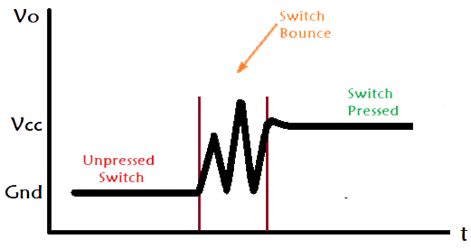

## Guia de Funcionamiento
### Descripcion
Esta practica consistio en resolver el problema de Bounce mediante los dos metodos mas famosos: Pull up y Pull down. utilizando un Diodo led como forma de indicador visual del funcionamiento adecuaco del circuito. El objetivo principal de esta practica es demostrar la interaccion por software y hardware para resolver los inconvenientes provocados por el fenomeno bounce utilizando un boton de ejemplo.

### Herramientas
- 1 Transistor BJT NPN 2N2222.
- 1 Push button.
- 1 Diodo led
- 1 Resistencia de 10kΩ.
- 1 Resistencia de 2.2kΩ.
- 1 Resistencia de 330Ω.
- 1 capacitor menor a 1uF **(Opcional)**.

### ¿Que es el Bounce?
Comunmente el fenomeno de Bounce (Rebote en Espaniol) se presenta cuando un contacto mecanico cambia de estado: abierto->cerrado o viceversa.
  
[1] P. Khatri, "What is Switch Bouncing and How to prevent it using Debounce Circuit," Circuit Digest, Jan. 6, 2022. [Online]. Available: https://circuitdigest.com/electronic-circuits/what-is-switch-bouncing-and-how-to-prevent-it-using-debounce-circuit. [Accessed: Jul. 23, 2026].

Como se puede apreciar en la imagen, el estado no cambia instantaneamente, en realidad los conctactos metalicos rebotan varias veces antes de quedar completamente unidos, lo que ocasiona que en unos miliseegundos la senal varie entre 0 y 1 repetidamente. En terminos de lectura el microcontrolador estaria leyendo datos no deseados, generando lecturas multiples de un solo evento fisico.   
Durante esta practica se utilizo un boton para trabajar este efecto, aunque no es el unico elemento exclusivo del mismo.  
Los componentes susceptibles a Bounce son:
- Interruptores (Switches).
- Reles electromecanicos.
- Microinterruptores.
- Encoders rotatorios mecanicos.
- Teclados mecanicos.

### Protocolos de interpretacion
Antes de solucionar este problema se debe elegir un metodo para interpretar el estado en el que se encuentre el boton, ya sea mediante Pull-up o Pull-down, ya que la senal que manda el boton en estado de reposo y activo varia dependiendo el protocolo, lo cual es un dato importante para implementar su solucion.

#### Pull-Down
Para esta solucion se debe conectar el botón entre la alimentación (3.3V) y el pin asignado para la lectura. Para que el pin tenga un estado definido cuando el botón no está presionado, se agrega una resistencia entre el pin y GND de forma que, en reposo, el pin queda leyendo **LOW**. 
Esta resistencia puede estar fisicamente asignada en el circuito (implementacion por **hardware**) o puede estar asignada por codigo (implementacion por **software**), porque la ESP32 cuenta internamente con resistencias que son aptas para resolver este problema. Al presionar el botón, la conexión directa a 3.3V domina sobre la resistencia, y el pin pasa a leer **HIGH**. 

#### Pull-Up
Aquí la lógica se invierte: el pin se mantiene en HIGH por default (hacia 3.3V), y el botón conecta hacia GND al presionarse, haciendo que el pin lea LOW mientras está presionado.

### (Codigo) Solucion por Debounce
Elegir el protocolo de interpretación (Pull-up o Pull-down) solo resuelve **qué** lee el pin en reposo, pero no resuelve el problema de fondo: durante la transición de un estado a otro, la senal sigue siendo inestable a causa del rebote. Es necesario, entonces, confirmar que un cambio de estado es real antes de aceptarlo como una pulsación válida.   
Por ende la estrategia implementada consiste en, al detectar una transición, esperar un breve periodo de tiempo (delay) y volver a leer el pin — si el estado se mantiene consistente tras esa espera, se confirma como una pulsación legítima, de lo contrario, se descarta como ruido.  
A continuación se detalla su implementación en código. 

#### Mpdulos importados
```rust
use esp_idf_svc::hal::gpio::{PinDriver, Pull, Input, Output};
use esp_idf_svc::hal::peripherals::Peripherals;
use esp_idf_svc::hal::delay::FreeRtos;
```
Siendo las funciones nuevas utilizadas:
- `Pull` = Indicando por software el tipo de protocolo de interpretacion del estado del pin que usaria el codigo.
- `Input` = Para controlar las entradas del pin asignado.

Se diseno una variable llamada "button" de caracter inmutable, la cual se creo usando la siguiente funcion:
```rust
PinDriver::input(...)
```
Cuando se utiliza `input`, internamente en el codigo se hace referencia a una funcion con el mismo nombre, el cual luce exactamente asi:
```rust
pub fn input<T: InputPin + 'd>(pin: T, pull: Pull)
```
Notese que entonces, cuando creamos una variable que recibe el trait de `Input`, el codigo internamente espera recibir tanto el Pin al que esa variable corresponde asi como al tipo de **pull** (protocolo de interpretacion) que debe seguir. 
De groso modo, el parametro `Pull`, resulta no ser mas que un Enum interno del propio Rust que solo acepta los siguientes parametros:
```rust
pub enum Pull {
    Floating,
    Up,
    Down,
    UpDown,
}
```
- `Up` -> Pull-up (Usando resistencia interna del microcontrolador)
- `Down` -> Pull-down (Usando resistencia interna del microcontrolador)
- `Floating` -> El microcontrolador **NO** usara resistencia interna, confiando totalmente que el circuito utilice una resistencia externa como metodo de Pull manual, siendo la implementacion por Hardware que se habia mencionado en el apartado de `Protocolos de interpretacion`. Si **no** se utiliza la resistencia extenra, se terminara generando un cortocircuito.
- `UpDown` -> Activa ambas resistencias internas (pull-up y pull-down) simultáneamente. No aplica a un uso convencional como el de esta práctica (generaría un voltaje intermedio ambiguo entre ambos estados); se reserva para casos especializados, como la detección de pines desconectados. No se utilizó en esta práctica.

Como se podra apreciar dentro del codigo, existen tres variables con el mismo nombre `boton` que se crearon mediante `PinDriver::input(...)`, cada una explorando los tres casos diferentes.  
```rust
let button = PinDriver::input(pins.gpio17, Pull::Floating).unwrap(); // Utiliza la resistencia externa que se utiliza dentro del circuito, sigue el protocolo Pull-down
let button = PinDriver::input(pins.gpio17, Pull::Down).unwrap(); // Utiliza el protocolo interno de Pull-down de la ESP32
let button = PinDriver::input(pins.gpio17, Pull::Up).unwrap(); // Utiliza el protocolo interno de Pull-Up de la ESP32
```
**Como nota de precaucion**: Actualmente hay dos variables comentadas y una en uso, si se pretende utilizar otra diferente, se deben comentar las otras dos y descomentar el bloque de funciones que haga referencia al protocolo utilizado, esto para evitar problemas de compilacion o comportamientos erraticos en ejecucion.

#### Bloques de funciones
Para abordar ambos protocolos se decidio dividir la logica en dos bloques de funciones excluyentes el uno del otro, por razones de simplicidad se trabajo de esta manera.  
No obstante el funcionamiento asi como la logica de ambas funciones es la misma, lo unico que varia es la interpretacion de ambos estados del boton.

##### Bloque enfocado a Pull-Down
Depende de la funcion wrapper que encapsula el resto de funciones y se encarga de controlar el flujo de la logica:
```rust
fn func_pull_down(button: &PinDriver<Input>, led: &mut PinDriver<Output>)
```
Es quien recibe el pin asignado al boton con el trait de Input sienoo inmutable, asi como el pin asignado al led con el trait de Output siendo mutable. Ambos pines se reciben por referencia.  
Es importante aclarar que esta funcion puede trabajar con ambos Enums que Rust espera recibir: Ya sea Pull-Down o Pull-floating.  
Una vez dentro se ejecuta el siguiente bloque de codigo
```rust
loop{
    if boton_control_down(&button){ 
        log::info!("Pulsacion confirmada!");
        led.set_high().unwrap();
        wait_for_release_down(&button);
        led.set_low().unwrap();
    }
    FreeRtos::delay_ms(50);
    }
```
Empieza evaluando el estado actual del boton mediante la funcion `boton_control_down`, en caso de recibir un `true` de la funcion:
- Imprime un mensaje de confirmacion.
- Enciende el led
- Le pasa el control a la funcion `wait_for_release_down` quien se encargara de filtrar los posibles rebotes del boton.
- Una vez se filtre, se apaga el led.

De haber recibido un `false` de la funcion, simplemente entraria en un delay de 50 ms para evitar saturar scheduler del FreeRTOS, evitando reinicios abruptos del microcontrolador por saturarse con el loop.  
La funcion encargada de filtrar los rebotes es la siguiente
```rust
fn boton_control_down(boton: &PinDriver<Input>) -> bool
```
Esperando recibir la variable inmutable de boton con el trait Input y retornando una variable de tipo `bool` dependiendo lo que ocurra. Su interior funciona asi:
```rust
if !boton.is_high() {
        return false;
    }
    FreeRtos::delay_ms(20);
    boton.is_high()
```
Comienza evaluando un condicional si el boton esta en estado HIGH (al ser pull down, se entiende que esta presionado.), de no estarlo simplemente regresa un `false`.   
En caso de que si se encuentre presionado, se va a esperar 20 ms para evaluar si sigue presionado o no, con este intervalo de tiempo podemos filtrar que haya sido de alguna vibracion o no.  
A diferencia de lenguajes explicitos como `C/C++`, con Rust podemos retornar un valor sin usar la palabra `return` y sin escribir explicitamente que valor se retorna: Cuando se llega a esta macro:
```rust
boton.is_high()
```
Rust va a devolver un `true` en caso de que efectivamente este en HIGH o un `false` en caso de que este en LOW. Este resultado sera quien le indique a la funcion previamente analizada `func_pull_down` para indicarle si enciende o no el led.  
Como dato curioso, esta funcion `boton_control_down` sera quien cambie en el estado Pull-up, y su cambio de comportamiento influye en un cambio de comportamiento directo a `func_pull_down`.

Por ultimo pasamos a la ultima funcion del bloque Pull-down:
```rust
fn wait_for_release_down(boton: &PinDriver<Input>)
```
Ya filtramos el ruido que se puede producir cuando se presiona un boton con `boton_control_down`, ahora nos falta filtrar el mismo ruido cuando el boton deja de presionarse.  
Siendo que internamente luce asi esta funcion:
```rust
FreeRtos::delay_ms(30);
while !boton.is_low(){
    FreeRtos::delay_ms(5);
    }
```
Inicialmente se espera 30 ms para permitir que desaparezcan los rebotes generados al abrirse los contactos del pulsador una vez se deja de presionar, después la función entra en un bucle que comprueba continuamente si el botón ya regresó al estado LOW, condición que indica que ha sido liberado en una configuración pull-down.
Mientras el pin siga sin marcar LOW (posible rebote), se espera 5 ms entre cada verificación, en cuanto la condición deja de cumplirse, se sale del ciclo.

Con esto se completa el flujo de filtrado de rebotes para la logica de Pull-down.

##### Bloque enfocado a Pull-Up
Esta sección sigue exactamente la misma lógica que el bloque Pull-Down explicado anteriormente, la única diferencia es la interpretación de los estados del pin, ya que con Pull-Up el botón presionado se lee como LOW (en vez de HIGH). Por esta razón, no se repetira la explicación detallada de cada línea sino que solo se documentaran las diferencias.

```rust
fn func_pull_up(button: &PinDriver<Input>, led: &mut PinDriver<Output>)
```
Misma función wrapper, misma estructura de loop, el único cambio real está en la condición evaluada:

```rust
if !boton_control_up(&button){ ... }
```
Nótese la negación `!` adicional, siendo necesaria porque `boton_control_up` también invierte su lógica internamente:

```rust
fn boton_control_up(boton: &PinDriver<Input>) -> bool {
    if !boton.is_low() {
        return false;
    }
    FreeRtos::delay_ms(20);
    boton.is_low()
}
```
Aquí se reemplaza cada `is_high()` por `is_low()` respecto a la versión Pull-Down, misma lógica de confirmación tras 20ms, invertida en su condición de lectura.

```rust
fn wait_for_release_up(boton: &PinDriver<Input>){
    FreeRtos::delay_ms(30);
    while !boton.is_high(){
        FreeRtos::delay_ms(5);
    }
}
```
De igual forma, internamente se reemplaza `!boton.is_low()` por `!boton.is_high()` en su condición del `while`, esperando ahora a que el pin regrese a HIGH (liberado) en vez de LOW.

### Extra: Filtrado mediante capacitor
Como se mencionó en las herramientas utilizadas, un capacitor también puede funcionar como filtro al bounce que se provoca en el cambio de estado, a diferencia de las soluciones anteriores (por software), este es un enfoque de filtrado **por hardware** donde la señal ya llega "limpia" al pin, antes de que el código intervenga.
Al usar esta variante, las funciones de filtrado por software (`wait_for_release_up`/`wait_for_release_down` y `boton_control_up`/`boton_control_down`) dejan de ser necesarias el capacitor ya resuelve el rebote a nivel eléctrico, por lo que basta con leer el pin directamente (`boton.is_high()`/`is_low()`) sin pasar por esa capa adicional de confirmación.  
Ambos enfoques (software y hardware) son válidos por separado; esta sección documenta la alternativa por hardware como comparación.
Para elaborar el circuito lo ideal es mantener el boton configurado como Pull-down o como Pull-floating (Si quieres usar una resistencia extena).
- Pull-floating: El capacitor se conecta en paralelo: una patita con la resistencia que protegue al pin de `input` y su otra pata con el gnd comun.
- Pull-down: Misma configuracion, solo que ahora el capacitor va con una pata directa al nodo comun entre el boton y el pin, mientras que su otra pata va en el gnd comun.

**Nota**: Si se va a usar un capacitor electrolitico recuerda revisar la conexion de sus terminales.  

Se recomienda utilizar capacitores menores a 1uF, puesto que mientras mayor capacitancia alberguen, mayor tiempo de descarga tendran, provocando que en escenarios donde se deje de presionar el boton, el capacitor entre en periodo de descarga, apoyandose de la formula t = 5RC. Mayor capacitancia, mayor sera t y con ello el tiempo que el codigo detectara al boton como pulsado.